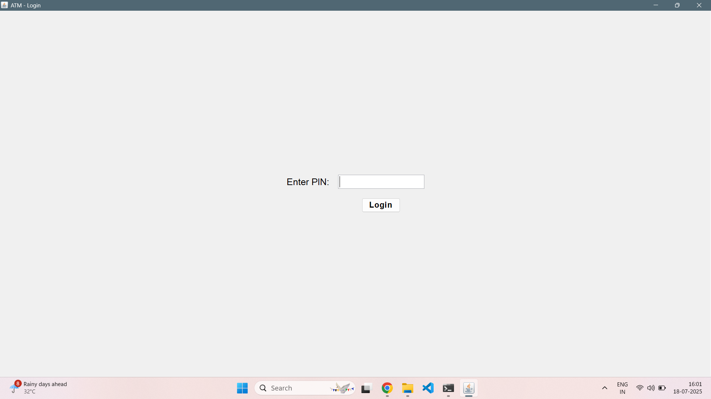
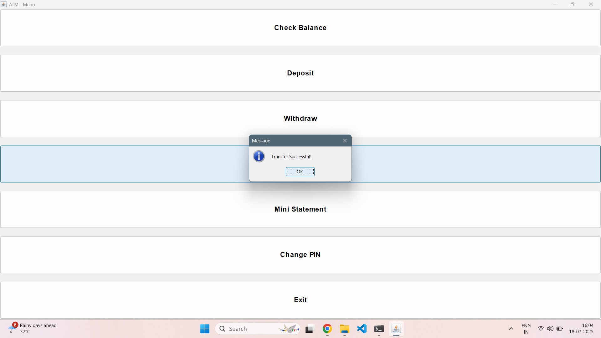
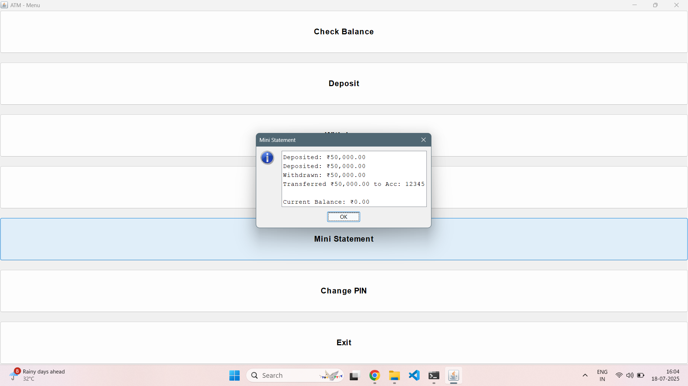
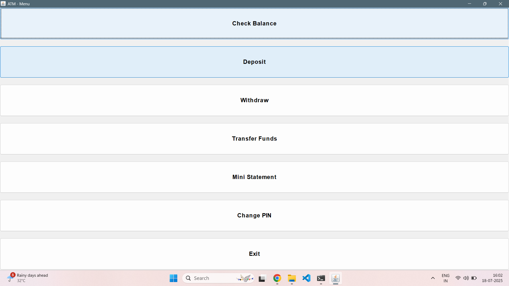
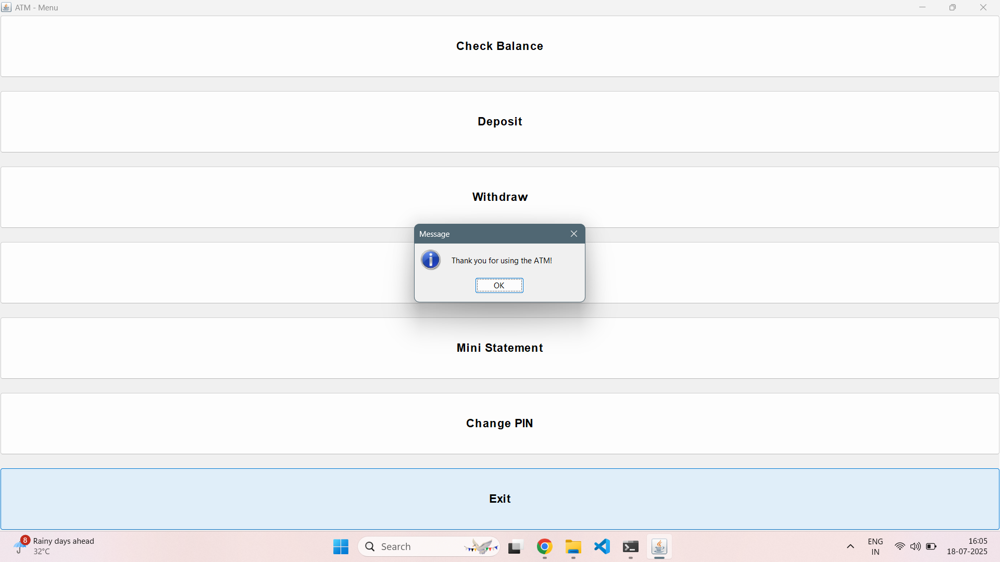

# 💳 ATM Machine Simulation (Java GUI Project)


This is a **Graphical User Interface (GUI)** based ATM simulation system built using **Java Swing**. The application simulates basic banking operations such as deposit, withdrawal, balance check, fund transfer, PIN change, and mini statement functionality with full-screen UI.

---

## 🚀 Features

- ✅ PIN-based login with limited attempts  
- 💵 Deposit money  
- 💸 Withdraw money with validation  
- 📋 View mini statement  
- 🔁 Transfer funds to other simulated accounts  
- 🔐 Change PIN securely  
- 📐 Full-screen GUI layout using Swing  
- 🪟 Centered components with formatted currency output  

---

## 🧰 Technologies Used

- Java (JDK 19)  
- Java Swing (GUI)  
- `ArrayList`, `HashMap` (Collections Framework)  
- `JOptionPane`, `JFrame`, `JPanel`, `JButton`, etc.  
- `DecimalFormat` for currency formatting  

---

## 📂 Project Structure

```
ATM-Machine-GUI/
├── ATMgui.java          # Main GUI Java file
├── README.md            # Project documentation
└── LICENSE              # (Optional) MIT License
```

---

## ▶️ How to Run

### 🔧 Prerequisites
- Java JDK 19 installed and configured in your system PATH  
- Java-compatible editor (e.g., VS Code, IntelliJ, NetBeans)

### 💻 Compile the code:
```bash
javac ATMgui.java
```

### 🚀 Run the application:
```bash
java ATMgui
```

---

## 🖼 GUI Preview

> The application launches in full screen  
> All ATM options are accessible via buttons  
> Popups are used for input and feedback  
> Balances appear formatted (e.g., ₹10,000.00)

---

## 📦 Future Enhancements

- [ ] Export mini statement to file  
- [ ] Store account and transaction data persistently  
- [ ] Add user login system with account registration  
- [ ] Package as `.jar` for easy sharing and launch  

---

## 📜 License

This project is licensed under the **MIT License**.  
See the [`LICENSE`](LICENSE) file for details.

---
## 📥 Download

➡️ [Download ATM GUI `.jar` file](https://github.com/palve-2003/ATM-Machine-GUI/releases)

---

## 🙋‍♂️ Author

**Nilesh Palve**  
📧 [palvenileshp@gmail.com](mailto:palvenileshp@gmail.com)

---

## 🖼️ Screenshots

### 🔐 Login Page


### 💰 Deposit Page


### 💸 Fund Transfer Page


### ✅ Transfer Success


### 📋 Mini Statement


### 🏠 Main Menu


### 🚪 Exit Page



